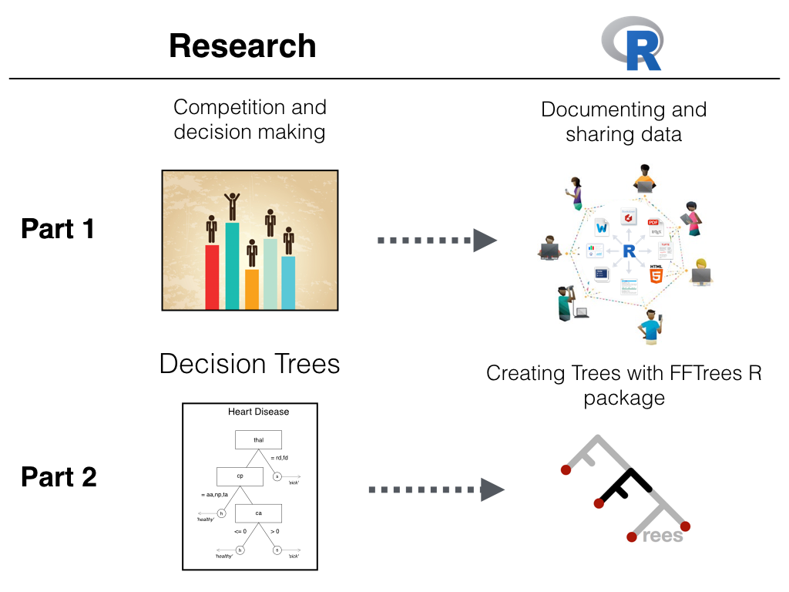
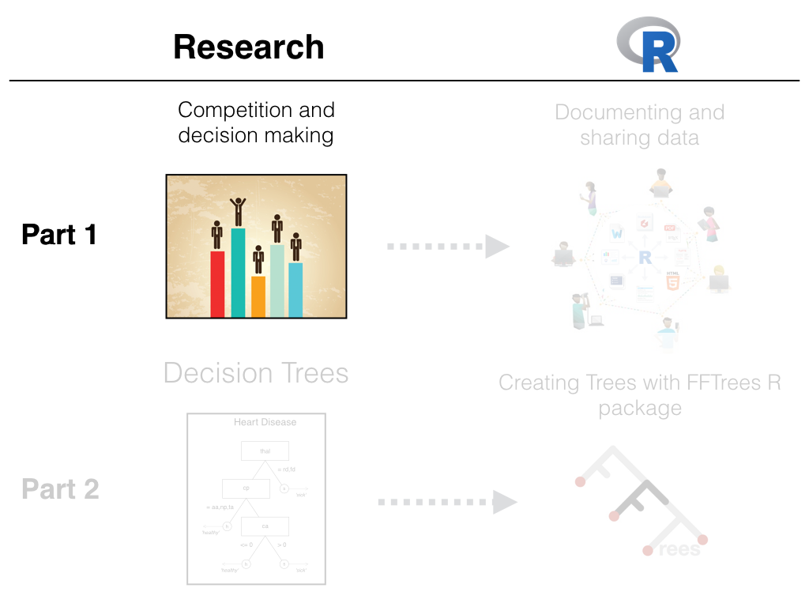
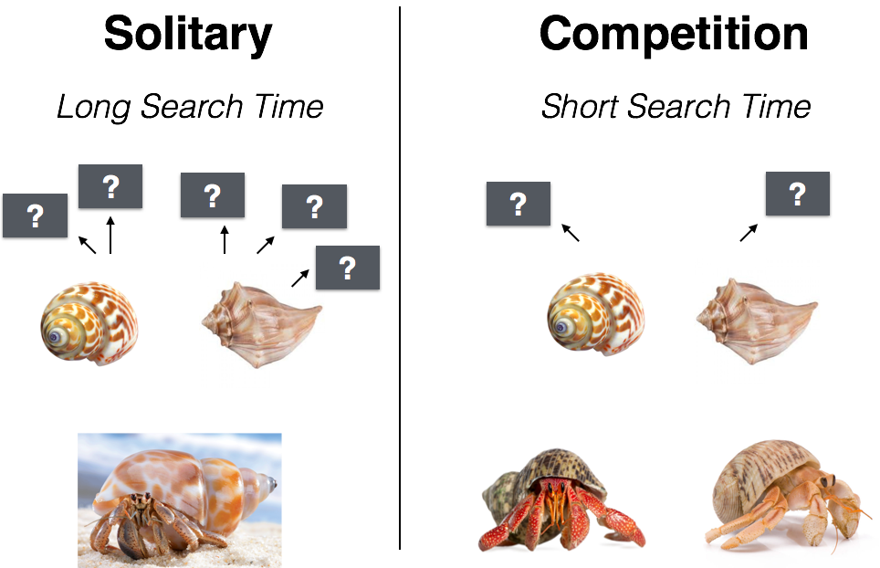
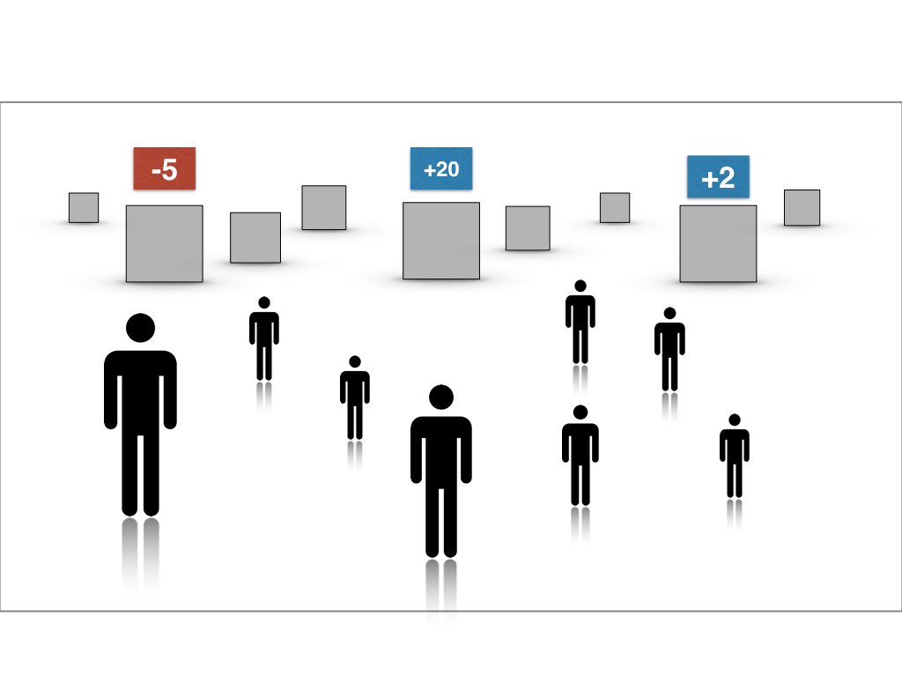
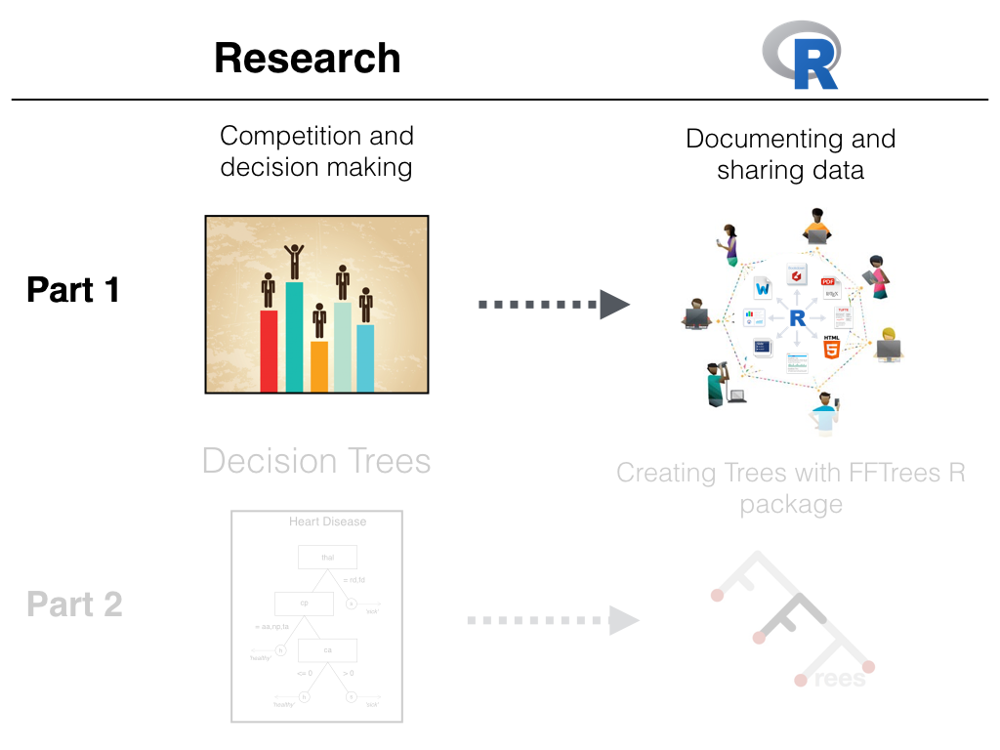
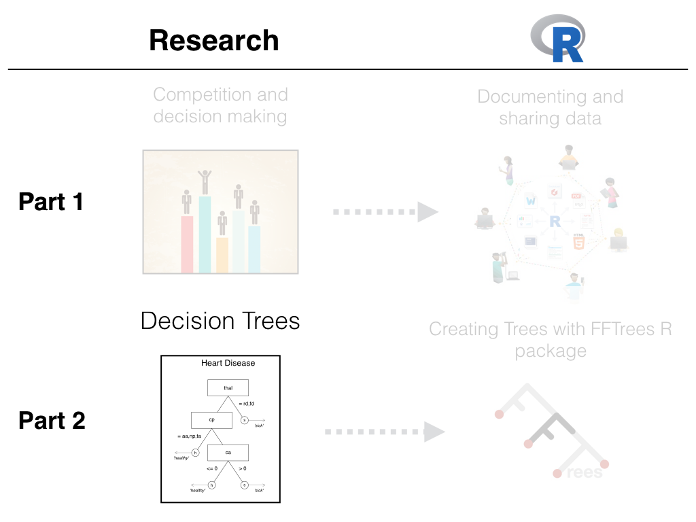
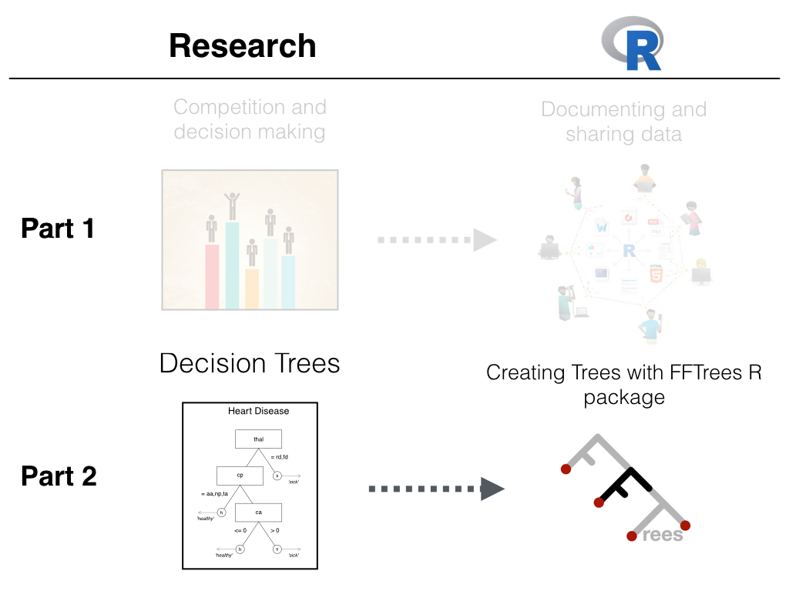

```{r, echo = FALSE}
load("data/BaselR_FFTrees.RData")
load("data/forensictrees.RData")
```

---


```{r, out.width = "85%", fig.align = "center", echo = FALSE}

```

---

```{r, out.width = "85%", fig.align = "center", echo = FALSE}

```


---
## Hermit crabs

```{r, out.width = "65%", fig.align = "center", echo = FALSE}
knitr::include_graphics("images/hermitcrab.gif")
```

Rotjan, R. D., Chabot, J. R., & Lewis, S. M. (2010). Social context of shell acquisition in Coenobita clypeatus hermit crabs. Behavioral Ecology, 21(3), 639–646.


---
## Hermit crabs

```{r, out.width = "75%", fig.align = "center", echo = FALSE}

```


--- .class #id 

## Phillips et al. (2014)


```{r, out.width = "100%", fig.align = "center", echo = FALSE}
knitr::include_graphics("images/rivals_screen.png")
```

--- .class #id 


```{r, out.width = "80%", fig.align = "center", echo = FALSE}
knitr::include_graphics("images/searchA.png")
```


--- .class #id 


```{r, out.width = "80%", fig.align = "center", echo = FALSE}
knitr::include_graphics("images/searchB.png")
```


--- .class #id 


```{r, out.width = "80%", fig.align = "center", echo = FALSE}
knitr::include_graphics("images/searchC.png")
```


--- .class #id 


```{r, out.width = "80%", fig.align = "center", echo = FALSE}

```

--- .class #id 


```{r, out.width = "80%", fig.align = "center", echo = FALSE}
knitr::include_graphics("images/searchE.png")
```

--- .class #id 


```{r, out.width = "80%", fig.align = "center", echo = FALSE}
knitr::include_graphics("images/searchF.png")
```


--- .class #id 

## The Competitive Sampling Game (CSG)

```{r, out.width = "80%", fig.align = "center", echo = FALSE}
knitr::include_graphics("images/gamediagram.png")
```


--- .class #id 


```{r, out.width = "100%", fig.align = "center", echo = FALSE}
knitr::include_graphics("images/sampleordecide.png")
```


--- .class #id 

## Pre-decisional search

```{r, out.width = '70%', fig.align = "center", echo = FALSE, message = FALSE, dpi = 200, fig.width = 6, fig.height = 5}
library(phillips2014rivals)

# Put data into one dataframe
sampling.data <- data.frame("condition" = c(rep("Solitary", times = nrow(Sol.Game.df)),
                                            rep("Competitive", times = nrow(Comp.Game.df))),
                   "trials" = c(Sol.Game.df$Sampling.Trials, Comp.Game.df$Trials), 
                   stringsAsFactors = FALSE)

# Create a pirateplot
yarrr::pirateplot(trials ~ condition, data = subset(sampling.data, condition == "Solitary"), xlim = c(.5, 2.5), 
                  sortx = "s", ylab = "Sampling Trials", cap.beans = TRUE, theme = 0, gl.col = "gray", xlab = "")       

```


--- .class #id 

## Pre-decisional search

```{r, out.width = '70%', fig.align = "center", echo = FALSE, message = FALSE, dpi = 200, fig.width = 6, fig.height = 5}
library(phillips2014rivals)

# Put data into one dataframe
sampling.data <- data.frame("condition" = c(rep("Solitary", times = nrow(Sol.Game.df)),
                                            rep("Competitive", times = nrow(Comp.Game.df))),
                   "trials" = c(Sol.Game.df$Sampling.Trials, Comp.Game.df$Trials), 
                   stringsAsFactors = FALSE)

# Create a pirateplot
yarrr::pirateplot(trials ~ condition, data = subset(sampling.data, condition == "Solitary"), xlim = c(.5, 2.5), 
                  sortx = "s", ylab = "Sampling Trials", cap.beans = TRUE, xlab = "")       

```

--- .class #id 

## Pre-decisional search

```{r, out.width = '70%', fig.align = "center", echo = FALSE, message = FALSE, dpi = 200, fig.width = 6, fig.height = 5}

# Create a pirateplot
yarrr::pirateplot(trials ~ condition, data = sampling.data, xlim = c(.5, 2.5), sortx = "s",
                  ylab = "Sampling Trials", cap.beans = TRUE, xlab = "")       

```

<!-- --- .class #id  -->

<!-- ## Barplot vs. Pirateplot -->

<!-- ```{r, fig.width = 12, fig.height = 6, echo = FALSE, out.width = "100%", dpi = 200, fig.align = 'center'} -->

<!-- par(mfrow = c(1, 2)) -->

<!-- # Create a pirateplot -->
<!-- yarrr::pirateplot(trials ~ condition, data = sampling.data, xlim = c(.5, 2.5),  -->
<!--                   sortx = "s", ylab = "Sampling Trials", cap.beans = TRUE, theme = 0,  -->
<!--                   bar.f.o = .2, inf.disp = "line", inf.f.o = 1,  -->
<!--                   pal = "black", ylim = c(0, 30), main = "A bad barplot")        -->

<!-- # Create a pirateplot -->
<!-- yarrr::pirateplot(trials ~ condition, data = sampling.data, xlim = c(.5, 2.5), sortx = "s", -->
<!--                   ylab = "Sampling Trials", cap.beans = TRUE, main = "An informative pirateplot")        -->

<!-- ``` -->


--- .class #id 

## Benefits of search

```{r, echo = FALSE, fig.align = 'center', fig.width = 6, fig.height = 5, out.width = "70%", dpi=200}

plot(x = 1:10, 
     y = 1:10, 
     type = "n", 
     ylim = c(.5, 1), 
     xlab = "Sample size", 
     ylab = "p(Choose high EV)", 
     main = "Choice accuracy | Sample Size",
     xaxt = "n")

axis(1, 1:10)

grid()
```


--- .class #id 

## Benefits of search

```{r, echo = FALSE, fig.align = 'center', fig.width = 6, fig.height = 5, out.width = "70%", dpi=200}
sample.sim <- Competitive.Sampling.Simulation.fun(Max.N = 10,      # Maximum sample size is 10
                                                  Sim.n = 1e3,     # Simulate 10,000 gambles 
                                                  Print.N = FALSE) # Don't print status reports

plot(x = 1:10, 
     y = sample.sim$`Solitary Performance`, 
     type = "b", 
     ylim = c(.5, 1), 
     xlab = "Sample size", 
     ylab = "p(Choose high EV)", 
     main = "Choice accuracy | Sample Size",
     xaxt = "n")

axis(1, 1:10)

grid()
```


--- .class #id 

## Observed Outcomes

```{r, out.width = '70%', fig.align = "center", echo = FALSE, message = FALSE, dpi = 200, fig.width = 6, fig.height = 5}
# Rearrange the data for the pirateplot
solitary.choices <- Sol.Game.df$ChoiceHEV
chooser.choices <- Comp.Game.df$Obtain.HEV[Comp.Game.df$Chooser == TRUE]
receiver.choices <- Comp.Game.df$Obtain.HEV[Comp.Game.df$Chooser == FALSE]

choice.data <- data.frame(group = c(rep("solitary", length(solitary.choices)),
                                    rep("chooser", length(chooser.choices)),
                                    rep("receiver", length(receiver.choices))),
                          "choice" = c(solitary.choices, chooser.choices, receiver.choices))

# Create the pirateplot
yarrr::pirateplot(choice ~ group, 
                  data = choice.data, 
                  sortx = "s", 
                  point.o = 0, 
                  main = "Choice Accuracy: p(Obtain high EV)", ylab = "Choice Accuracy")

abline(h = .5)

abline(v = 1.5)
text(1, .95, labels = "Solitary", font = 2)
text(2.5, .95, labels = "Competition", font = 2)
```


---

```{r, out.width = "85%", fig.align = "center", echo = FALSE}

```


---&twocol

## Documenting and sharing data

***=left

- How can I store, document, and share data and analyses in an open and transparent way?

| Method|Availability| Documentation | Accuracy
|:-------------:|----:|:-----|:----|
|Don't share|    Low|Low     |Low  
|By request only|    Medium|Low     |Low  
|Post data online|    High|Medium     |Medium    |
|Markdown + R package|    High|High     |High    |

***=right

```{r, out.width = "80%", fig.align = "center", echo = FALSE}
knitr::include_graphics("images/replicationcrisis.png")
```

```{r, out.width = "50%", fig.align = "center", echo = FALSE}
knitr::include_graphics("images/cos_stack.png")
```


---&twocol

## Why R?

***=left

- Free, open source, shareable, replicable.
- Huge developer community.
- R is the language of modern data science
    - Big data, natural language processing

```{r , fig.margin = TRUE, echo = FALSE, out.width = "80%", fig.align='center', message = FALSE, echo = FALSE}
 knitr::include_graphics(c("images/Rlogo.png"))
```

***=right

#### "To be able to choose between proprietary software packages is to be able to choose your master. Freedom means not having a master. And in the area of computing, freedom means not using proprietary software." -- Richard M. Stallman

<br>

#### "Closed source software is useless crap because it satisfies neither repeatability nor inspectability" -- Titus Brown
 


--- .class #id 

```{r, out.width = "85%", fig.align = "center", echo = FALSE}
knitr::include_graphics("images/markdownexamples.png")
```


--- .class #id 

## R manuscript package

- Include data, documentation, vignettes and tutorials written in R Markdown.

```{r, out.width = "80%", fig.align = "center", echo = FALSE}
knitr::include_graphics("images/rpackagediagram.png")
```

- Now everyone (even your future self) can always recover the data and analyses. Anytime. Anywhere.

--- .class #id 

## Phillips et al. (2014)

All data analyses, and data descriptions are stored in an R manuscript package called `phillips2014rivals` available in a package `phillips2014rivals_0.1.0.tar` at [https://goo.gl/q6GvBk](https://goo.gl/q6GvBk)

```{r, eval = FALSE}
# Install the phillips2014rivals R package
# Package file: phillips2014rivals_0.1.0.tar, 
# Link to package file: https://goo.gl/q6GvBk

install.packages("https://goo.gl/q6GvBk", 
                 repos = NULL, 
                 type = "source")
```


### Demo


---&twocol

***=left

### R Documentation Pros

- Data are fully organized, documented, and linked to the analyses.
- Accessible to anyone (like your future self) with one line of code.
    - R becomes not just a statistical engine, but a fully documented data repository.
- Packages make your research interactive -- calls for other researchers to get involved.


### R Documentation Cons

- It takes time!


***=right

```{r, eval = TRUE, echo = FALSE, out.width = "100%"}
knitr::include_graphics("images/rstudioss2.png")
```


<!-- ---&twocol -->

<!-- ***=left -->

<!-- ### 5 Selfish reasons to share data -->

<!-- 1. Gives your research credibility. -->
<!-- 2. Forces you to look for bugs, and document. -->
<!-- 3. Invites other researchers to get involved, cite and collaborate. -->
<!-- 4. Get constructive feedback. -->
<!-- 5. Know that you're contributing to open science. -->

<!-- ***=right -->

<!-- ```{r, eval = TRUE, echo = FALSE, out.width = "75%"} -->
<!--  -->
<!-- ``` -->

<!-- Wagenmakers, E. J., & Dutilh, G. (2016). Seven Selfish Reasons for Preregistration. APS Observer, 29(9). -->

---

```{r, out.width = "85%", fig.align = "center", echo = FALSE}

```


---&twocol

## Complexity vs. Simplicity

***=left

<br>

```{r, eval = TRUE, echo = FALSE, out.width = "100%", fig.align = 'center'}
knitr::include_graphics("images/complexity.jpg")
```

***=right

<br>

```{r, eval = TRUE, echo = FALSE, out.width = "95%", fig.align = 'center'}
knitr::include_graphics("images/decisionsimple.jpg")
```

<!-- --- .class #id  -->

<!-- ## Emergency Room overload -->

<!-- ```{r, fig.margin = TRUE, echo = FALSE, eval = TRUE, out.width = "60%", fig.align='center'} -->
<!-- knitr::include_graphics(c("images/crowdedemergency.jpg")) -->
<!-- ``` -->

<!-- - Cook County Hospital, 1996 -->
<!-- - 250,000 patients per year, Not enough space, Complete chaos -->

<!--"As the city’s principal public hospital, Cook County was the place of last resort for the hundreds of thousands of Chicagoans without health insurance. Resources were stretched to the limit. The hospital’s cavernous wards were built for another century. There were no private rooms, and patients were separated by flimsy plywood dividers. There was no cafeteria or private telephone—just a payphone for everyone at the end of the hall. In one possibly apocryphal story, doctors once trained a homeless man to do routine lab tests because there was no one else available." Malcolm Gladwell, Blink. -->


<!-- --- &twocol -->

<!-- *** =left -->

<!-- ## Heart attacks (?) -->

<!-- A significant number of those people filing into the ED—on average, about thirty a day—were worried that they were having a heart attack.  Chest-pain patients were resource-intensive. The treatment protocol was long and elaborate and—worst of all—maddeningly inconclusive. --> 

<!-- - 30 people a day worried about a heart attack -->
<!-- - **Coronary care bed** ($2,000 a night + 3 day stay) or **Regular bed** -->
<!-- - Goal: send true heart attacks to the coronary care bed, and true healthy patients to a normal bed. -->

<!-- ### Multiple, uncertain measures -->

<!-- - Electrocardiogram (ECG), Blood pressure, Stethescope, How long? How much? During exercise? History? Cholesterol? Drugs? etc. -->


<!-- *** =right -->

<!-- ```{r , fig.margin = TRUE, echo = FALSE, out.width = "80%", fig.align='center'} -->
<!-- knitr::include_graphics(c("images/paindecision.png")) -->
<!-- ``` -->


<!-- ---&twocol -->

<!-- ## Solution: a fast and frugal tree (FFT) -->

<!-- ***=left -->

<!-- - A fast and frugal decision tree (FFT) developed by Lee Goldman. -->
<!-- - Doctor's accuracy: 75-90% -->
<!-- - Decision tree accuracy: 95% -->
<!-- - Tree had far fewer false-positives and huge cost savings -->
<!-- - To this day, the tree is still used at the hospital. -->

<!-- ***=right -->

<!-- ```{r , fig.margin = TRUE, echo = FALSE, out.width = "70%", fig.align='center'} -->
<!-- knitr::include_graphics(c("images/cooktree.png")) -->
<!-- ``` -->


---

## Decision Strategies


| | Compensatory|Non-Compensatory |
|:---------|:----|:-----|
|     Example|    Weighted averaging: Expected utility, Tally, Bayes|Heuristics: Take the Best, Tit-for-tat|
|     Information Requirements|    High|Low     |
|     Search|    Comprehensive|Sequential     |
|     Speed|    Slow|Fast     |
| When do people use? <br>(Payne, Bettman, Johnson, 1993)| Low time pressure, high processing capacity | High time-pressure, low processing capacity |


--- &twocol

## Fast and Frugal Trees (FFTs)

***=left

#### Descriptive

- Inference (Gigerenzer & Goldstein, 1996)
- Judge's bailing decisions (Dhami, 2003)
- Competition "Tit-for-Tat" (Axelrod, 1984)
- Social "Imitate the successful" (Boyd & Richerson, 2005)

#### Prescriptive

- Heart disease (Breiman et al. 1993)
- Terrorist attacks (Garcia, 2016)
- Bank failure (Aikman et al., 2014; Neth et al., 2014)


***=right

```{r , fig.margin = TRUE, echo = FALSE, out.width = "100%", fig.align='center', message = FALSE, echo = FALSE}
knitr::include_graphics(c("images/nethfft.png"))
```

Neth et al. (2014). "Homo heuristicus in the financial world".

---

```{r, out.width = "85%", fig.align = "center", echo = FALSE}

```


---&twocol
## FFTrees

***=left

- `FFTrees` An easy-to-use R package to create, visualize, and implement fast and frugal decision trees.

<br>
<div style="text-align:left"><font size="1"> Phillips et al. (under review). FFTrees: An R package to create, visualize, and implement fast and frugal decision trees</font></div>


***=right

```{r, eval = FALSE}
# Install FFTrees to R.
install.packages("FFTrees")
```


```{r , fig.margin = TRUE, echo = FALSE, out.width = "80%", fig.align='center', message = FALSE, echo = FALSE}
 knitr::include_graphics(c("images/FFTrees_Logo.jpg"))
```


```{r, echo = FALSE, message = FALSE}
library(FFTrees)
load(file = "/Users/nphillips/Dropbox/manuscripts/ForensicFFT/data/ForensicFFTManuscript.RData")
load("data/UZurich.RData")
```


---&twocol
## Patient Release Decisions

***=left

- How can we explain psychiatric patient release decisions?
- Dataset: Release decisions from 1101 patients described by 46 cues (age, sex, diagnosis, drug history, etc...)
- Goal: Compare a fast and frugal decision tree model of release decisions to regression.

***=right

```{r , fig.margin = TRUE, echo = FALSE, out.width = "100%", fig.align='center', message = FALSE, echo = FALSE}
knitr::include_graphics(c("images/hospital.jpg"))
```


```{r , fig.margin = TRUE, echo = FALSE, out.width = "30%", fig.align='center', message = FALSE, echo = FALSE}
# knitr::include_graphics(c("images/FFTrees_Logo.jpg"))
```


```{r, echo = FALSE, message = FALSE}
library(FFTrees)
load(file = "/Users/nphillips/Dropbox/manuscripts/ForensicFFT/data/ForensicFFTManuscript.RData")
```


<!-- ---  -->

<!-- ```{r, eval = TRUE, fig.align = 'center', echo = FALSE ,message = FALSE, dpi = 200, out.width = "70%", fig.width = 8, fig.height = 8} -->
<!-- library(FFTrees) -->
<!-- load(file = "/Users/nphillips/Dropbox/manuscripts/ForensicFFT/data/ForensicFFTManuscript.RData") -->
<!-- plot(tree.63.m,  -->
<!--      main = "Psychiatric patient FFT",  -->
<!--      decision.names = c("High-Risk", "Low-Risk"),  -->
<!--      stats = FALSE) -->
<!-- ``` -->


---
## Creating regression and FFT models

```{r, eval = FALSE}
# Creating a regression decision model with glm()
patient.glm <- glm(formula = decision ~ .,
                   data = patient.data,
                   family = "binomial")
```


---
## Regression

- 10 significant predictors of release decisions.

```{r, eval = TRUE, fig.align = 'center', echo = FALSE ,message = FALSE, dpi = 200, out.width = "55%", message = FALSE, warning=FALSE}
valid <- sapply(1:ncol(fds.63.data), FUN = function(x) {length(unique(fds.63.data[,x])) > 1})

forensic.glm <- glm(formula = fds.63.crit ~ .,
                   data = fds.63.data[,valid & names(fds.63.data) != "yit"],
                   family = "binomial")

coef <- as.matrix(summary(aov(forensic.glm))[[1]])
coef <- coef[1:(nrow(coef) - 1),]
coef <- coef[coef[,5] < .05,]
coef <- cbind(1:nrow(coef), coef)
knitr::kable(coef[,c(1,2, 5, 6)], digits = 3)
```

```{r echo = FALSE}
set.seed(100)
library(FFTrees)
load(file = "/Users/nphillips/Dropbox/manuscripts/ForensicFFT/data/ForensicFFTManuscript.RData")
x <- FFTrees::FFTrees(fds.63.crit ~ ., data = fds.63.data[, names(fds.63.data) != "yit"])
```


---

## 3 Steps to creating FFTs with FFTrees

```{r, eval = FALSE}
# Step 0: Install FFTrees
install.packages("FFTrees")

# Step 1: Load the package
library("FFTrees")

# Step 2: Create an fft decision model with FFTrees
patient.fft <- FFTrees(formula = decision ~.,
                       data = patient.data)
```


---
## How trees are built with FFTrees

1. For each cue, calculate a decision threshold that maximizes accuracy.
2. Rank order cues by their maximum accuracy
3. Select the top N (i.e., 4) accurate cues
    - If any lower levels contain less than 10\% of the data, remove them.
4. Select the exit structure with the highest accuracy.


---

```{r, eval = FALSE}
# Show the cue accuracies
plot(patient.fft, what = "cues", main = "Patient cues")
```


```{r, echo = FALSE, fig.align = 'center', dpi = 200, out.width = "55%", fig.width = 8, fig.height = 8}
plot(x, 
     what = "cues", 
     main = "Patient Cues")
```


--- 

```{r, eval = FALSE}
plot(patient.fft, main = "Release Decision FFT", stats = FALSE)
```


```{r, eval = TRUE, fig.align = 'center', echo = FALSE ,message = FALSE, dpi = 200, out.width = "70%", fig.width = 8, fig.height = 7}
plot(x, 
     main = "Release Decision FFT", 
     decision.names = c("Unlikely Release", "Likely Release"), stats = FALSE)
```

--- 

```{r eval = FALSE}
plot(patient.fft)
```


```{r, eval = TRUE, fig.align = 'center', echo = FALSE ,message = FALSE, dpi = 200, out.width = "65%", fig.width = 8, fig.height = 7}
plot(x, 
     main = "Release Decision FFT", 
     decision.names = c("Unlikely Release", "Likely Release"))
```


---
## Comparing decision accuracy


### Data fitting accuracy

- Regression:, 79%, FFT: 68%

### Prediction simulation

- 1,000 Cross-validation prediction simulations

```{r , fig.margin = TRUE, echo = FALSE, out.width = "40%", fig.align='center', fig.cap = "Cross Validation procedure"}
knitr::include_graphics(c("images/crossvalidation.jpg"))
```


--- .class #id 

## How accurate can a simple tree be?

```{r , fig.margin = TRUE, echo = FALSE, out.width = "75%", fig.align='center'}
knitr::include_graphics(c("images/P63_SimulationPP.png"))
```


---&twocol

***=left

## Generalizing FFTrees

- The `FFTrees` package can be used with any dataset with a binary criterion.
- Simulation: 10 diverse datasets taken from the UCI Machine Learning Database.
- FFTrees vs. regression, Naive Bayes, Random Forests and more

### How well can a simple fast and frugal tree predict data?  

***=right

```{r , fig.margin = TRUE, echo = FALSE, out.width = "90%", fig.align='center'}
knitr::include_graphics(c("images/datacollage.png"))
```


---

```{r, eval = FALSE}
heart.fft <- FFTrees(diagnosis ~ ., data = heartdisease)
```

```{r, echo = FALSE, out.width = "55%", dpi = 200, fig.width = 8, fig.height = 7, fig.align = 'center'}
plot(heart.fft, main = "Heart Disease")
```

---

```{r, eval = FALSE}
mushrooms.fft <- FFTrees(poisonous ~ ., data = mushrooms)
```

```{r, echo = FALSE, out.width = "55%", dpi = 200, fig.width = 8, fig.height = 7, fig.align = 'center'}
plot(mushrooms.fft, main = "Mushroom Toxicity")
```

--- .class #id 
## Prediction accuracy across 10 dasets

```{r , fig.margin = TRUE, echo = FALSE, out.width = "90%", fig.align='center'}
knitr::include_graphics(c("images/simulationagg_c.png"))
```


---

## FFTrees conclusion

- With the `FFTrees` R package, you can create descriptive or prescriptive fast and frugal trees and compare to compensatory models.
- If data can be predicted by a very simple model, then that model should be seriously considered, even if it is terribly naive.


```{r , fig.margin = TRUE, echo = FALSE, out.width = "50%", fig.align='center', message = FALSE, echo = FALSE, eval = FALSE}
knitr::include_graphics(c("images/FFTrees_Logo.jpg"))
```

```{r , fig.margin = TRUE, echo = FALSE, out.width = "75%", fig.align='center', message = FALSE, echo = FALSE}
 knitr::include_graphics(c("images/decisionheads.png"))
```

```{r, echo = FALSE, eval = FALSE}
set.seed(101)
x <- seq(0, 100, length.out = 20)
y <- 2 * x
y.noisy <- y + rnorm(20, mean = 0, sd = 50)

plot(x, y.noisy)

model <- lm(y.noisy ~ poly(x,9))
model.pred <- model$fitted.values

lines(x, model.pred, col = "red", lwd = 2)

abline(lm(y.noisy ~ x), col = "blue", lwd = 2)
```


---&twocol

***=left

## If you only remember two things...

1. Share and document your data and analyses -- R has great tools to do this.
2. Consider simple heuristics, like fast and frugal trees, in addition to compensatory models.


***=right
<br>
<br>

```{r, echo = FALSE, out.width = "90%"}
knitr::include_graphics("images/rpackagediagram.png")
```

```{r, echo = FALSE, out.width = "70%"}
knitr::include_graphics("images/FFTrees_Logo.jpg")
```


```{r , fig.margin = TRUE, echo = FALSE, out.width = "50%", fig.align='center'}
#knitr::include_graphics(c("images/minimalist.jpg"))
```


---&twocol
## Collaborators

***=left


- Joerg Rieskamp (University of Basel)

- Ralph Hertwig (MPI for Human Development)
- Yaakov Kareev (Hebrew University of Jerusalem)
- Judith Avrahami (Hebrew University of Jerusalem)

- Wolfgang Gaissmaier (University of Konstanz)
- Hansjoerg Neth  (University of Konstanz)
- Jan Woike  (MPI for Human Development)

***=right

```{r , fig.margin = TRUE, echo = FALSE, out.width = "90%", fig.align='center'}
knitr::include_graphics(c("images/photocollage.png"))
```


--- .class #id 

### Simply your life with R: From sharing and documenting research to modeling simple decisions.

#### My Links

- This presentation: [https://ndphillips.github.io/UZurich-6April2017/](https://ndphillips.github.io/UZurich-6April2017/)
- Website: https://ndphillips.github.io
- Email: Nathaniel.D.Phillips.is@gmail.com

#### Packages

- FFTrees: `install.packages("FFTrees")`
- yarrr: `install.packages("yarrr")`

#### Tutorials

- YaRrr! The Pirate's Guide to R: www.thepiratesguidetor.com
- R Markdown: http://rmarkdown.rstudio.com/


--- .class #id 
## 5 Steps to creating an R package

[Full tutorial: http://rpubs.com/ndphillips/rpackagescience](Detailed instructions at http://rpubs.com/ndphillips/rpackagescience)

0. Create necessary folders `/data`, `/R`, `/vignettes`, `/inst`
1. Create a package description file `DESCRIPTION.txt`.
2. Put data files in `/data` and `/inst` folders, all R code in `/R`
3. Write documentation files for all data in `/data`
4. Write vignettes in Markdown and put in `/vignettes`
5. Build the package with the `build()` function.
    - Returns a single R package file: `phillips2014rivals_0.1.0.tar`


---&twocol
## Efficiency

***=left

- FFTs are very cheap to implement

- Heart disease data
    - Regression: $300
    - rpart: > $100
    - Heart disease FFT: $75.91

***=right

```{r , fig.margin = TRUE, echo = FALSE, out.width = "100%", fig.align='center', message = FALSE, echo = FALSE}
knitr::include_graphics(c("images/traintreestats.png"))
```


--- .class #id 
## Speed and frugality


```{r, echo = FALSE, fig.align = 'center', fig.width = 6, fig.height = 6, out.width = "60%", dpi = 200}

data.name <- c("arrhythmia", "audiology", "breast", "bridges", "cmc", "credit", "dermatology", "heart", "occupancy", "yeast")
mcu <- c(1.85, 1.73, 1.39, 2.40, 2.06, 1.9, 1.69, 1.72, 1.92, 1.63)
pci <- c(.99, .98, .86, .76, .79, .88, .95, .88, .68, .82)

plot(mcu, pci, xlim = c(1, 10), ylim = c(0, 1), xlab = "Mean cues used to make a decision", 
     ylab = "Percent of information ignored", pch = 21, col = "white", 
     bg = yarrr::piratepal("basel", trans = .2), cex = 2, main = "FFTrees speed and frugality", xaxt = "n", yaxt = "n", type = "n")
grid()
axis(1, 1:10)
axis(2, seq(0, 1, .2), las = 1)

rect(7, .05, 10, .95, col = yarrr::transparent("white", .2), border = gray(.5, .5))

text(rep(8, length(data.name)), seq(.1, .9, length.out = length(data.name)), labels = data.name, adj = 0)
points(rep(7.5, length(data.name)), seq(.1, .9, length.out = length(data.name)), pch = 21, col = "white", bg = yarrr::piratepal("basel", trans = .2), cex = 2)


```


--- .class #id 
## Speed and frugality


```{r, echo = FALSE, fig.align = 'center', fig.width = 6, fig.height = 6, out.width = "60%", dpi = 200}

data.name <- c("arrhythmia", "audiology", "breast", "bridges", "cmc", "credit", "dermatology", "heart", "occupancy", "yeast")
mcu <- c(1.85, 1.73, 1.39, 2.40, 2.06, 1.9, 1.69, 1.72, 1.92, 1.63)
pci <- c(.99, .98, .86, .76, .79, .88, .95, .88, .68, .82)

plot(mcu, pci, xlim = c(1, 10), ylim = c(0, 1), xlab = "Mean cues used to make a decision", 
     ylab = "Percent of information ignored", pch = 21, col = "white", 
     bg = yarrr::piratepal("basel", trans = .2), cex = 2, main = "FFTrees speed and frugality", xaxt = "n", yaxt = "n")
grid()
axis(1, 1:10)
axis(2, seq(0, 1, .2), las = 1)

rect(7, .05, 10, .95, col = yarrr::transparent("white", .2), border = gray(.5, .5))

text(rep(8, length(data.name)), seq(.1, .9, length.out = length(data.name)), labels = data.name, adj = 0)
points(rep(7.5, length(data.name)), seq(.1, .9, length.out = length(data.name)), pch = 21, col = "white", bg = yarrr::piratepal("basel", trans = .7), cex = 2)

segments(mcu, pci, rep(7.5, length(data.name)), seq(.1, .9, length.out = length(data.name)), col = gray(.5, .2))


```


---
## A forensic non-frugal tree

```{r, eval = TRUE, fig.align = 'center', echo = FALSE ,message = FALSE, dpi = 200, out.width = "55%"}
library(rpart)
forensic.cart <- rpart::rpart(fds.63.crit ~ ., data = fds.63.data)
plot(forensic.cart)
text(forensic.cart)
```
