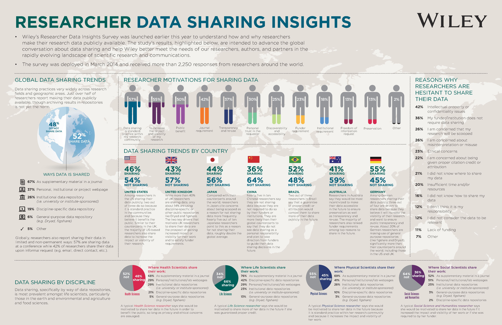
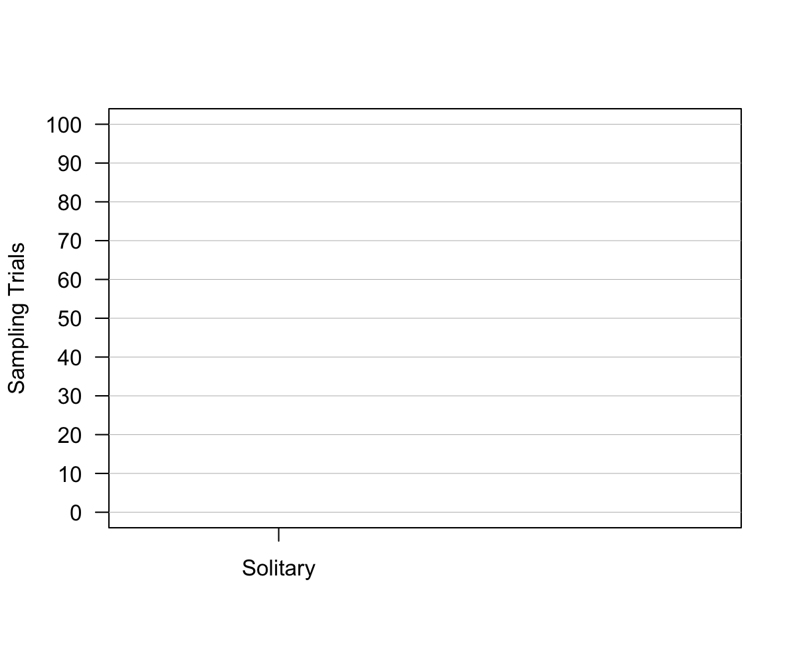
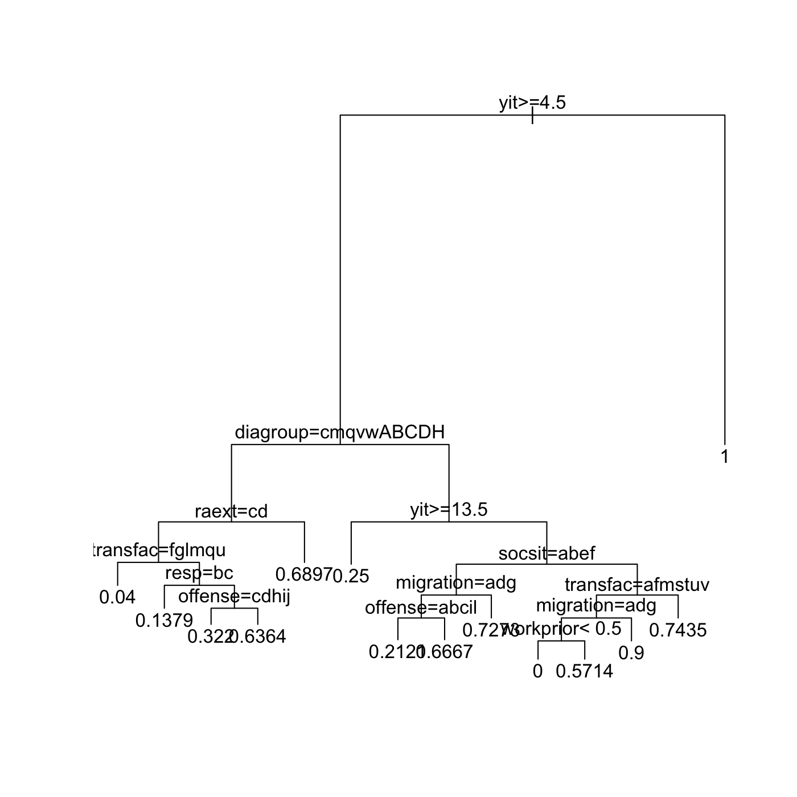
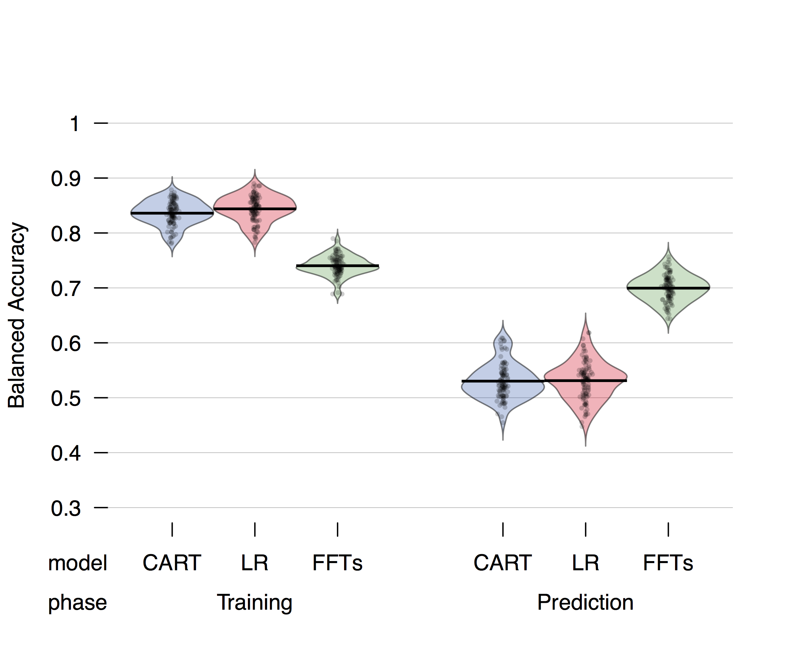
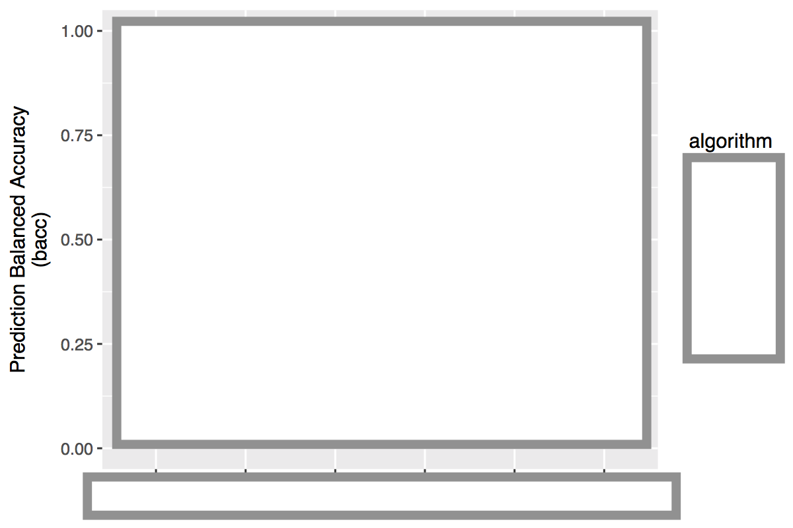
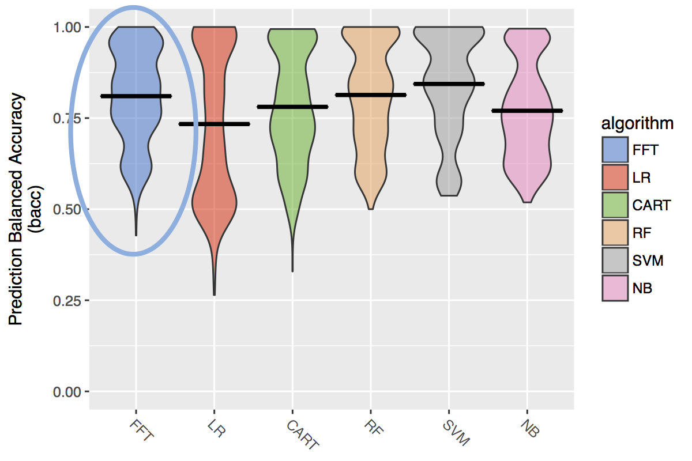

## A love letter to R

1. Todd Hare
2. Philip Topler
3. Christian Ruff


1. R is a tool for open, efficient research
    - Story: asking for data
    - Problem: Our data management process is scattered.
    - Solution: An interconnected system that ties a thread to each stage of the research process
        - Replicable, documented, shareable.
    - If you're going to spend the time to collect data and write a paper, you should also dedicate time to making the data available and as useable as possible.
    - Stages of research: 
    - Open source quotes.
    - Markdown
        - Sharing ideas and code online with rpubs.
    - Programming online experiments with Shiny.
    - Writing papers with Markdown or Sweave
    - Documenting code with an R package (and OSF)
        - phillips2014competition package

2. Making good decisions with R
    - FFTrees package
        - Simulation results
    - Predicting patient release decisions

3. 

3. Conclusion
    - R 


--- .class #id 

## Many reseearch topics, but one thread

- Wisdom of crowds within one mind,
- Bayesian reasoning.
- Decision making under competition
- Fast and frugal decision trees

One thread: R
- Formulize theoretical predictions with simulations
- Document and share my data and analyses
- Visualize data in a transparent, and interesting, way
- Construct simple decision making tools (fast and frugal decision trees)


--- .class #id 

## Asking for data

- Towards the start of my PhD, I requested data from someone. Here was the response:

"This data is pretty old [It was from a 5 year old publication] and it would take me a while to find it. If you can collaborate with a more senior researcher, and have a specific research question [I did], I might be able to locate it."


--- .class #id 



--- .class #id 

## The data -- analysis -- writing link

- For many researchers, while the publication is important to share, the data and analyses details are not.
- After publication, the raw data are now 'old' (or are kept for personal use)
- An old boys club -- "Only established researchers, who might benefit me, can get the data"

--- .class #id 

## A solution: sharing data as an R package

- Store everything in an R package.
    - Data, data descriptions, analyses, tutorials
- Share the package at the time of publication (before someone asks for it)


--- .class #id 

## Example: Phillips et al. (2014)


--- .class #id 

## Phillips et al. (2014)


--- .class #id 

## Phillips et al. (2014)


--- .class #id 

## Phillips et al. (2014)


--- .class #id 

## Phillips et al. (2014)


--- .class #id 

## Phillips et al. (2014)


--- .class #id 

## Phillips et al. (2014)


--- .class #id 

## Phillips et al. (2014)


--- .class #id 

## Phillips et al. (2014)

This is all the code you need to access the data

```
install.packages("https://goo.gl/q6GvBk", 
                 repos = NULL, 
                 type = "source")
```

--- .class #id 

## Example: Phillips et al. (2014)


--- .class #id 

## Example: Phillips et al. (2014)


--- .class #id 

## Example: Phillips et al. (2014)



--- .class #id 

## Example: Phillips et al. (2014)


--- .class #id 

## A bad plot!


--- .class #id 

## Example: Phillips et al. (2014)


---&twocol

***=left

### Competitive decision making under uncertainty


Phillips et al. (2014). Rivals in the dark: How competition influences search and decisions under uncertainty

***=right

### Advantages of an R package

- Data are immediately available and fully documented.
- Analyses are always connected to the data.
- Explain data, models and analyses with vignettes.
- Not just good for others, but also for your future self


```r
# Get the data, documentation, and analyses
install.packages("https://goo.gl/q6GvBk", 
                 repos = NULL, 
                 type = "source")
```


--- .class #id 

## Making good decisions

- R is not just good for documenting and sharing research, it can also help you to make better, faster decisions. Here's how:


<!-- --- .class #id  -->

<!-- ## Emergency Room overload -->

<!-- ```{r, fig.margin = TRUE, echo = FALSE, eval = TRUE, out.width = "60%", fig.align='center'} -->
<!-- knitr::include_graphics(c("images/crowdedemergency.jpg")) -->
<!-- ``` -->

<!-- - Cook County Hospital, 1996 -->
<!-- - 250,000 patients per year, Not enough space, Complete chaos -->

<!--"As the city’s principal public hospital, Cook County was the place of last resort for the hundreds of thousands of Chicagoans without health insurance. Resources were stretched to the limit. The hospital’s cavernous wards were built for another century. There were no private rooms, and patients were separated by flimsy plywood dividers. There was no cafeteria or private telephone—just a payphone for everyone at the end of the hall. In one possibly apocryphal story, doctors once trained a homeless man to do routine lab tests because there was no one else available." Malcolm Gladwell, Blink. -->


<!-- --- &twocol -->

<!-- *** =left -->

<!-- ## Heart attacks (?) -->

<!-- A significant number of those people filing into the ED—on average, about thirty a day—were worried that they were having a heart attack.  Chest-pain patients were resource-intensive. The treatment protocol was long and elaborate and—worst of all—maddeningly inconclusive. --> 

<!-- - 30 people a day worried about a heart attack -->
<!-- - **Coronary care bed** ($2,000 a night + 3 day stay) or **Regular bed** -->
<!-- - Goal: send true heart attacks to the coronary care bed, and true healthy patients to a normal bed. -->

<!-- ### Multiple, uncertain measures -->

<!-- - Electrocardiogram (ECG), Blood pressure, Stethescope, How long? How much? During exercise? History? Cholesterol? Drugs? etc. -->


<!-- *** =right -->

<!-- ```{r , fig.margin = TRUE, echo = FALSE, out.width = "80%", fig.align='center'} -->
<!-- knitr::include_graphics(c("images/paindecision.png")) -->
<!-- ``` -->


<!-- ---&twocol -->

<!-- ## Solution: a fast and frugal tree (FFT) -->

<!-- ***=left -->

<!-- - A fast and frugal decision tree (FFT) developed by Lee Goldman. -->
<!-- - Doctor's accuracy: 75-90% -->
<!-- - Decision tree accuracy: 95% -->
<!-- - Tree had far fewer false-positives and huge cost savings -->
<!-- - To this day, the tree is still used at the hospital. -->

<!-- ***=right -->

<!-- ```{r , fig.margin = TRUE, echo = FALSE, out.width = "70%", fig.align='center'} -->
<!-- knitr::include_graphics(c("images/cooktree.png")) -->
<!-- ``` -->


---&twocol
## Predicting patient outcomes


***=left

- How can we predict which patients are at risk for psychiatric treatment failure?
- If you know who is at risk, you can do targeted care, plan and allocate resources.

- Baden Werttemberg DATASET
- 1101 patients, 46 cues (age, sex, diagnosis, drug history, etc...)
- Linear regression finds 12 significant cues (out of the original 46)

***=right


--- &twocol

## Fast and Frugal tree

***=left

- A fast and frugal decision tree (FFT) is the simplest possible decision tree (Martignon et al., 2008).
- Easy to understand, consistent, requires little information, can be calculated 'in the head'
- FFTs have been used to predict depression (Jenny et al., 2013), terrorist attacks (Garcia, 2016), and bank failure (Aikman et al., 2014; Neth et al., 2014)

- Can an FFT create a simple, interpretable model of patient success?

***=right


--- .class #id 
## FFTrees

- There is no off-the-shelf method to construct FFTs.
- Create `FFTrees`, an easy-to-use R package that constructs, visualizes, and implements FFTs.


--- .class #id 
## Getting FFTrees


```r
# Step 0: Install and load FFTrees
install.packages("FFTrees")
library("FFTrees")

# Step 1: Create the trees
patient.fft <- FFTrees(formula = fds.63.crit ~., 
                     data = fds.63.data)

# Step 2: View summary statistics
print(patient.fft)

# Step 3: Visualise the tree
plot(patient.fft)
```


--- 
## A forensic FFT


--- 
## A forensic non-frugal tree




---&twocol

## How accurate can a simple tree be?

- The tree is simple, but how accurate can it be?

***=left

### Prediction simulation

- Cross-validation prediction simulation.
- Compare the performance of fast and frugal trees created by `FFTrees` to regression and (non-frugal) decision trees.

***=right


--- .class #id 

## How accurate can a simple tree be?




--- .class #id 
## Aggregate simulation prediction results



Phillips, Neth, Gaissmaier & Woike (under review)

--- .class #id 
## Aggregate simulation prediction results


--- .class #id 
## Aggregate simulation prediction results




--- .class #id 
## FFT conclusions

1. Simple decision strategies can be extremely effective, even for complex tasks. R, along with `FFTrees` can help.

--- .class #id 
## What have we learned.


- Open science is the way forward.
- R can help you promote and share your work in a transparent, effective way
- Make simpler, better decisions with `FFTrees`

---&twocol
## Collaborators

***=left


- Joerg Rieskamp (University of Basel)

- Ralph Hertwig (MPI for Human Development)
- Yaakov Kareev (Hebrew University of Jerusalem)
- Judith Avrahami (Hebrew University of Jerusalem)

- Wolfgang Gaissmaier (University of Konstanz)
- Hansjoerg Neth  (University of Konstanz)
- Jan Woike  (MPI for Human Development)

***=right


--- .class #id 

### Simply your life with R. From making decisions to sharing and documenting research


Website: https://ndphillips.github.io

Email: Nathaniel.D.Phillips.is@gmail.com

FFTrees Package: `install.packages("FFTrees")`

yarrr package: `install.packages("yarrr")`

YaRrr! The Pirate's Guide to R: www.thepiratesguidetor.com

