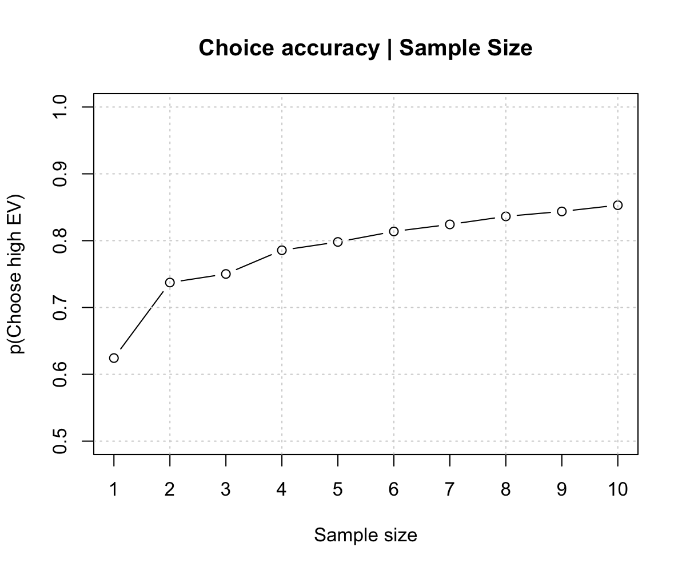
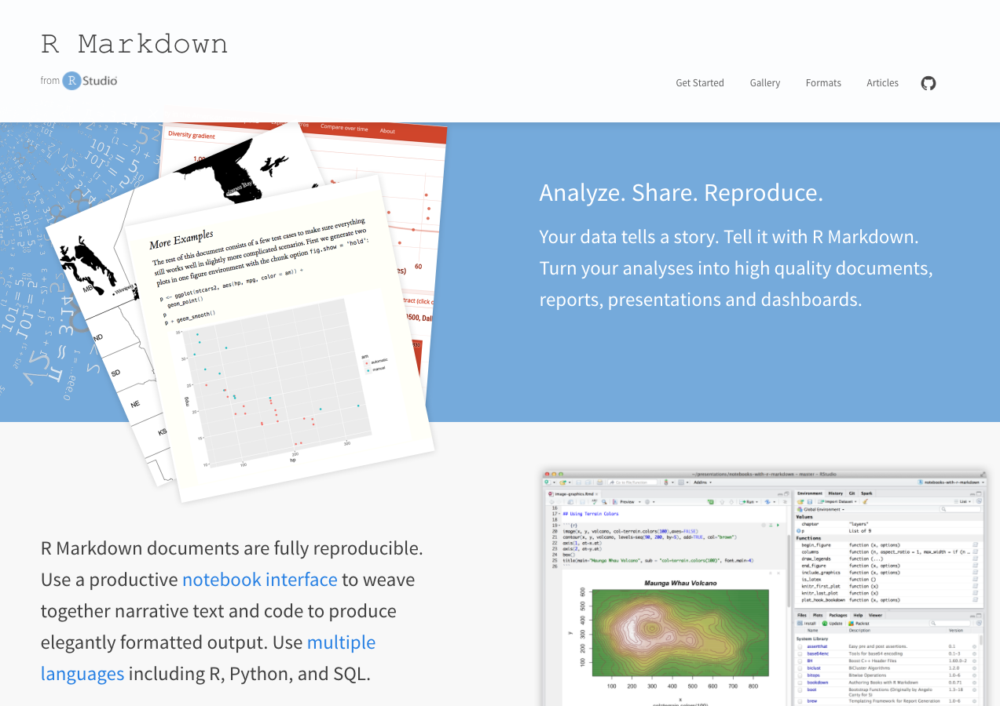
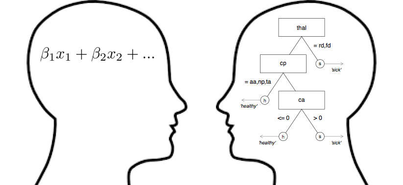

---


## Four main research topics, one common thread


---
## Hermit crabs


Rotjan, R. D., Chabot, J. R., & Lewis, S. M. (2010). Social context of shell acquisition in Coenobita clypeatus hermit crabs. Behavioral Ecology, 21(3), 639–646.


---
## Hermit crabs


--- .class #id 

## Phillips et al. (2014)


--- .class #id 


--- .class #id 


--- .class #id 


--- .class #id 


--- .class #id 


--- .class #id 


--- .class #id 

## The Competitive Sampling Game (CSG)


--- .class #id 


--- .class #id 

## Example: Phillips et al. (2014)


--- .class #id 

## Example: Phillips et al. (2014)


--- .class #id 

## Example: Phillips et al. (2014)


<!-- --- .class #id  -->

<!-- ## Barplot vs. Pirateplot -->

<!-- ```{r, fig.width = 12, fig.height = 6, echo = FALSE, out.width = "100%", dpi = 200, fig.align = 'center'} -->

<!-- par(mfrow = c(1, 2)) -->

<!-- # Create a pirateplot -->
<!-- yarrr::pirateplot(trials ~ condition, data = sampling.data, xlim = c(.5, 2.5),  -->
<!--                   sortx = "s", ylab = "Sampling Trials", cap.beans = TRUE, theme = 0,  -->
<!--                   bar.f.o = .2, inf.disp = "line", inf.f.o = 1,  -->
<!--                   pal = "black", ylim = c(0, 30), main = "A bad barplot")        -->

<!-- # Create a pirateplot -->
<!-- yarrr::pirateplot(trials ~ condition, data = sampling.data, xlim = c(.5, 2.5), sortx = "s", -->
<!--                   ylab = "Sampling Trials", cap.beans = TRUE, main = "An informative pirateplot")        -->

<!-- ``` -->


--- .class #id 

## Why did competition decrease search so much?


--- .class #id 

## Why did competition decrease search so much?


--- .class #id 

## Example: Phillips et al. (2014)




---&twocol

## Documenting and sharing data

***=left

- How can I store, document, and share data and analyses in an open and transparent way?

### 5 Selfish reasons to share data

1. Gives your research credibility (Wagenmakers & Dutilh, 2016).
2. Forces you to look for bugs, and document.
3. Invites other researchers to get involved, cite and collaborate (Piwowar et al, 2007).
4. Get constructive feedback.
5. Know that you're contributing to open science (Wagenmakers & Dutilh, 2016)


***=right


--- .class #id 

## A solution: Reasearch as an R manuscript package

- Store everything in an R package: Data, data descriptions, analyses, tutorials.


- Share the package at the time of publication (before someone asks for it)
- Now everyone (even your future self) can always recover the data and analyses. Anytime. Anywhere.


--- .class #id 





--- .class #id 

## Markdown

- Write vignettes and examples using Markdown (aka, LaTeX light)
- Markdown = Text + Code + Output.
- Result: Data, Analyses and Output are linked.


--- .class #id 

## Phillips et al. (2014)

All data analyses, and data descriptions are stored in an R manuscript package called `phillips2014rivals` available at [https://goo.gl/q6GvBk](https://goo.gl/q6GvBk)


```r
# Install the phillips2014rivals R package

install.packages("https://goo.gl/q6GvBk", 
                 repos = NULL, 
                 type = "source")
```


--- .class #id 


--- .class #id 

## Data documentation


---&twocol

***=left

### R manuscript package pros

- Data are fully organized, documented, and linked to the analyses.
- Accessible to anyone (like your future self) with one line of code.
    - R becomes not just a statistical engine, but a fully documented data repository.
- Packages make your research interactive -- calls for other researchers to get involved.


***=right


<!-- ---&twocol -->

<!-- ***=left -->

<!-- ### 5 Selfish reasons to share data -->

<!-- 1. Gives your research credibility. -->
<!-- 2. Forces you to look for bugs, and document. -->
<!-- 3. Invites other researchers to get involved, cite and collaborate. -->
<!-- 4. Get constructive feedback. -->
<!-- 5. Know that you're contributing to open science. -->

<!-- ***=right -->

<!-- ```{r, eval = TRUE, echo = FALSE, out.width = "75%"} -->
<!-- knitr::include_graphics("images/selfishreasons.jpg") -->
<!-- ``` -->

<!-- Wagenmakers, E. J., & Dutilh, G. (2016). Seven Selfish Reasons for Preregistration. APS Observer, 29(9). -->

---&twocol

## Complexity vs. Simplicity

***=left

<br>


***=right

<br>


<!-- --- .class #id  -->

<!-- ## Emergency Room overload -->

<!-- ```{r, fig.margin = TRUE, echo = FALSE, eval = TRUE, out.width = "60%", fig.align='center'} -->
<!-- knitr::include_graphics(c("images/crowdedemergency.jpg")) -->
<!-- ``` -->

<!-- - Cook County Hospital, 1996 -->
<!-- - 250,000 patients per year, Not enough space, Complete chaos -->

<!--"As the city’s principal public hospital, Cook County was the place of last resort for the hundreds of thousands of Chicagoans without health insurance. Resources were stretched to the limit. The hospital’s cavernous wards were built for another century. There were no private rooms, and patients were separated by flimsy plywood dividers. There was no cafeteria or private telephone—just a payphone for everyone at the end of the hall. In one possibly apocryphal story, doctors once trained a homeless man to do routine lab tests because there was no one else available." Malcolm Gladwell, Blink. -->


<!-- --- &twocol -->

<!-- *** =left -->

<!-- ## Heart attacks (?) -->

<!-- A significant number of those people filing into the ED—on average, about thirty a day—were worried that they were having a heart attack.  Chest-pain patients were resource-intensive. The treatment protocol was long and elaborate and—worst of all—maddeningly inconclusive. --> 

<!-- - 30 people a day worried about a heart attack -->
<!-- - **Coronary care bed** ($2,000 a night + 3 day stay) or **Regular bed** -->
<!-- - Goal: send true heart attacks to the coronary care bed, and true healthy patients to a normal bed. -->

<!-- ### Multiple, uncertain measures -->

<!-- - Electrocardiogram (ECG), Blood pressure, Stethescope, How long? How much? During exercise? History? Cholesterol? Drugs? etc. -->


<!-- *** =right -->

<!-- ```{r , fig.margin = TRUE, echo = FALSE, out.width = "80%", fig.align='center'} -->
<!-- knitr::include_graphics(c("images/paindecision.png")) -->
<!-- ``` -->


<!-- ---&twocol -->

<!-- ## Solution: a fast and frugal tree (FFT) -->

<!-- ***=left -->

<!-- - A fast and frugal decision tree (FFT) developed by Lee Goldman. -->
<!-- - Doctor's accuracy: 75-90% -->
<!-- - Decision tree accuracy: 95% -->
<!-- - Tree had far fewer false-positives and huge cost savings -->
<!-- - To this day, the tree is still used at the hospital. -->

<!-- ***=right -->

<!-- ```{r , fig.margin = TRUE, echo = FALSE, out.width = "70%", fig.align='center'} -->
<!-- knitr::include_graphics(c("images/cooktree.png")) -->
<!-- ``` -->


---

## Decision Strategies


| | Compensatory|Non-Compensatory |
|:---------|:----|:-----|
|     Example|    Weighted averaging: Expected utility, Tally, Bayes|Heuristics: Take the Best, Tit-for-tat|
|     Information Requirements|    High|Low     |
|     Search|    Comprehensive|Sequential     |
|     Speed|    Slow|Fast     |
| When do people use? <br>(Payne, Bettman, Johnson, 1993)| Low time pressure, high processing capacity | High time-pressure, low processing capacity |


--- &twocol

## Fast and Frugal Trees (FFTs)

***=left

#### Descriptive

- Inference (Gigerenzer & Goldstein, 1996)
- Judge's bailing decisions (Dhami, 2003)
- Competition "Tit-for-Tat" (Axelrod, 1984)
- Social "Imitate the successful" (Boyd & Richerson, 2005)

#### Prescriptive

- Heart disease (Breiman et al. 1993)
- Terrorist attacks (Garcia, 2016)
- Bank failure (Aikman et al., 2014; Neth et al., 2014)


***=right


Neth et al. (2014). "Homo heuristicus in the financial world".


---&twocol
## FFTrees

***=left

- Problem: There is no widely available tool to create FFTs from data.
    - Tools-to-theories heuristic (Gigerenzer, 1991)
- `FFTrees`

<br>
<div style="text-align:left"><font size="1"> Phillips et al. (under review). FFTrees: An R package to create, visualise, and impliment fast and frugal decision trees</font></div>


***=right


```r
# Install FFTrees
install.packages("FFTrees")

# Create FFTs from data
my.fft <- FFTrees(formula = decision ~.,
                  data = data)
```


---&twocol
## Patient Release Decisions

***=left

- How can we explain psychiatric patient release decisions?
- Dataset: Release decisions from 1101 patients described by 46 cues (age, sex, diagnosis, drug history, etc...)
- Goal: Create a fast and frugal decision tree to predict release decisions

***=right


<!-- ---  -->

<!-- ```{r, eval = TRUE, fig.align = 'center', echo = FALSE ,message = FALSE, dpi = 200, out.width = "70%", fig.width = 8, fig.height = 8} -->
<!-- library(FFTrees) -->
<!-- load(file = "/Users/nphillips/Dropbox/manuscripts/ForensicFFT/data/ForensicFFTManuscript.RData") -->
<!-- plot(tree.63.m,  -->
<!--      main = "Psychiatric patient FFT",  -->
<!--      decision.names = c("High-Risk", "Low-Risk"),  -->
<!--      stats = FALSE) -->
<!-- ``` -->


---
## Regression


```r
forensic.lm <- glm(formula = decision ~ .,
                   data = patient.data,
                   family = "binomial")
```


|            |   | Df| F value| Pr(>F)|
|:-----------|--:|--:|-------:|------:|
|socsit      |  1|  6|   8.604|  0.000|
|schoolqual  |  2|  6|   5.076|  0.000|
|migration   |  3|  6|   3.166|  0.005|
|transfac    |  4| 14|   2.539|  0.002|
|withdr      |  5|  1|  10.526|  0.001|
|offense     |  6| 10|   3.154|  0.001|
|sentence    |  7|  1|  10.880|  0.001|
|prisonprior |  8|  1|   4.578|  0.033|
|raext       |  9|  3|   8.060|  0.000|
|migration2  | 10|  1|   4.256|  0.040|


--- 


```r
patient.fft <- FFTrees(formula = decision ~., 
                       data = patient.data)
```


--- 


---

## How accurate can a simple tree be?

### Prediction simulation

- 1,000 Cross-validation prediction simulations
- Compare FFTrees to regression and non-frugal decision trees.


--- .class #id 

## How accurate can a simple tree be?


---&twocol

***=left

## Generalizing FFTrees

- The `FFTrees` package can be used with any dataset with a binary criterion.
- Simulation: 10 diverse datasets taken from the UCI Machine Learning Database.
- FFTrees vs. regression, Naive Bayes, Random Forests and more

### How well can a simple fast and frugal tree predict data?  

***=right


--- .class #id 
## Speed and frugality


--- .class #id 
## Speed and frugality


--- .class #id 
## Prediction accuracy across 10 dasets


Phillips, Neth, Gaissmaier & Woike (under review)

--- .class #id 
## Prediction accuracy across 10 dasets


--- .class #id 
## Prediction accuracy across 10 dasets


---

## FFTrees conclusion

- Fast and frugal trees are promising descriptive and prescriptive models of decision making.
    - Now with the `FFTrees` R package, you can create them and compare to compensatory models.
- If data can be predicted by a very simple model, then that model should be seriously considered, even if it is terribly naive.





---&twocol

***=left

## If you only remember two things...

1. Share and document your data and analyses -- R has great tools to do this.
2. Consider simple heuristics in addition to compensatory models.


***=right
<br>
<br>


---&twocol
## Collaborators

***=left


- Joerg Rieskamp (University of Basel)

- Ralph Hertwig (MPI for Human Development)
- Yaakov Kareev (Hebrew University of Jerusalem)
- Judith Avrahami (Hebrew University of Jerusalem)

- Wolfgang Gaissmaier (University of Konstanz)
- Hansjoerg Neth  (University of Konstanz)
- Jan Woike  (MPI for Human Development)

***=right


--- .class #id 

### Simply your life with R: From sharing and documenting research to modeling simple decisions.

#### My Links

- This presentation: [https://ndphillips.github.io/UZurich-6April2017/](https://ndphillips.github.io/UZurich-6April2017/)
- Website: https://ndphillips.github.io
- Email: Nathaniel.D.Phillips.is@gmail.com

#### Packages

- FFTrees: `install.packages("FFTrees")`
- yarrr: `install.packages("yarrr")`

#### Tutorials

- YaRrr! The Pirate's Guide to R: www.thepiratesguidetor.com
- R Markdown: http://rmarkdown.rstudio.com/


---&twocol
## Efficiency

***=left

- FFTs are very cheap to implement

- Heart disease data
    - Regression: $300
    - rpart: > $100
    - Heart disease FFT: $75.91

***=right


---
## A forensic non-frugal tree


