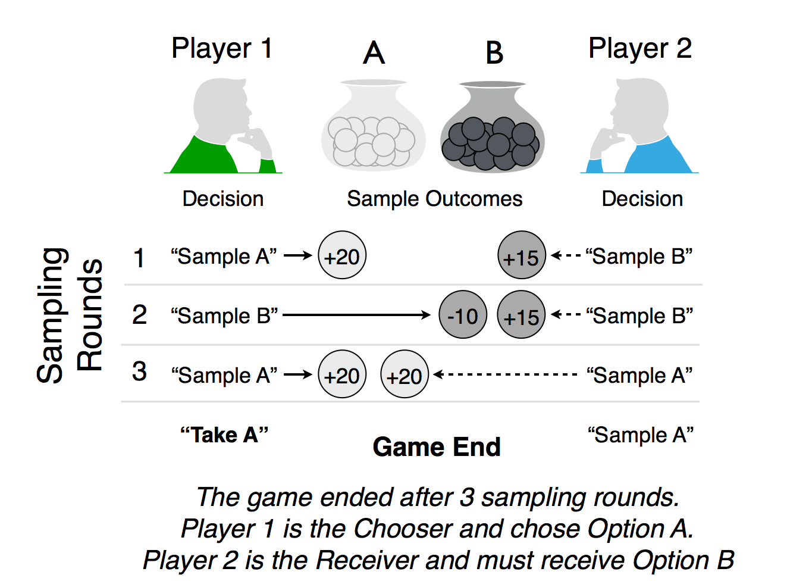
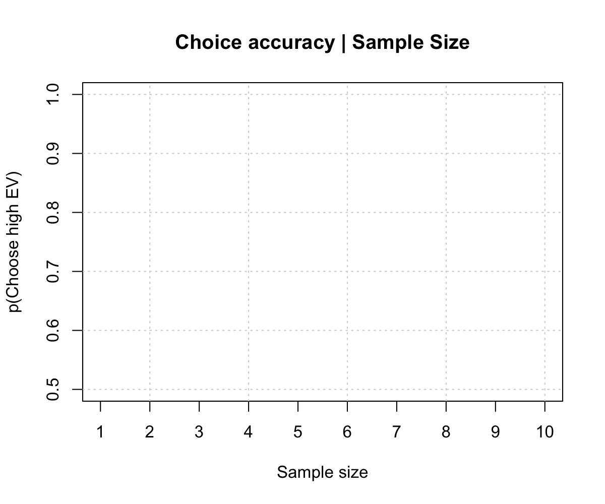
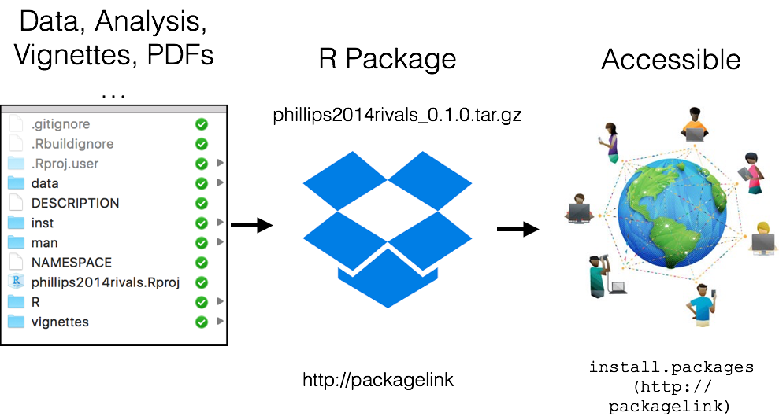
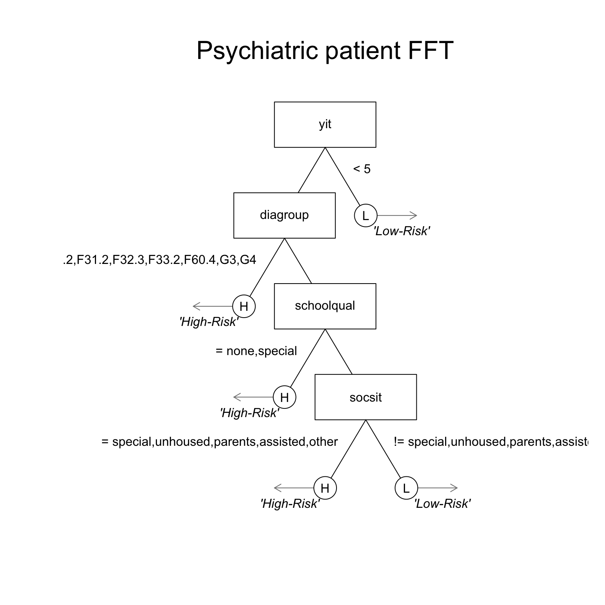
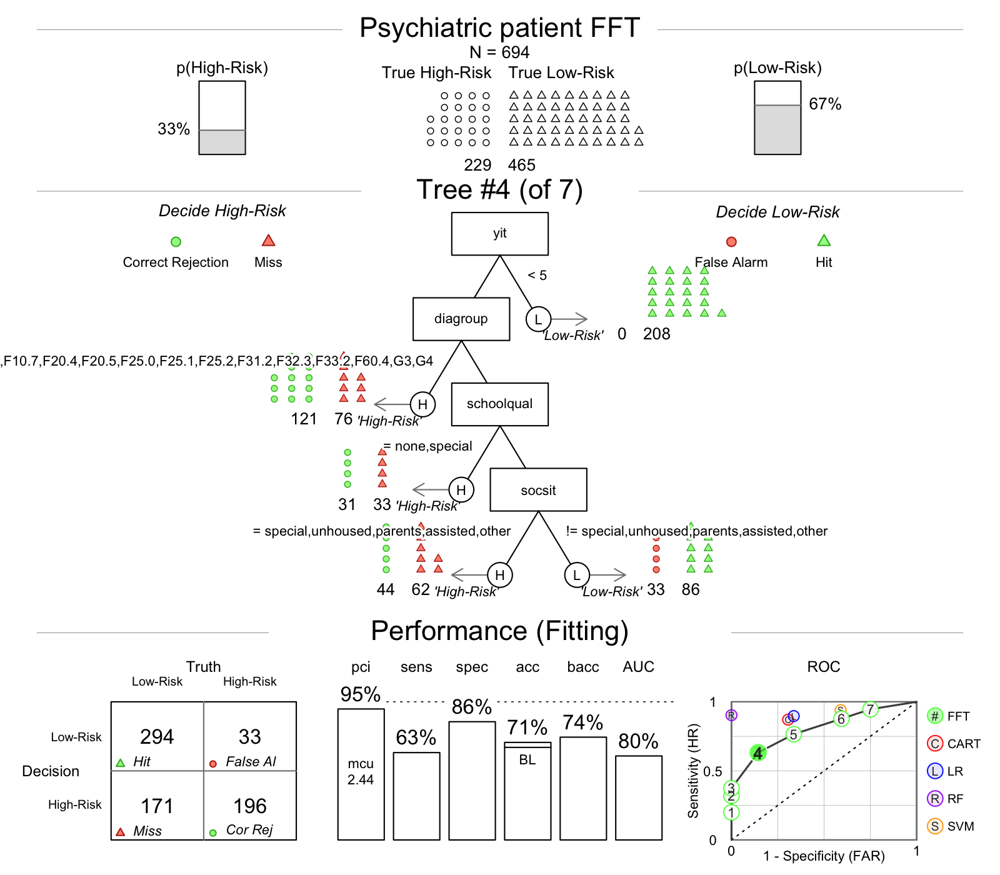
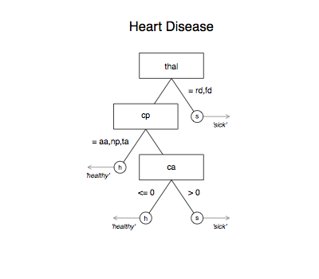

---


## Many research topics, one common thread


---
## Hermit crabs


Rotjan, R. D., Chabot, J. R., & Lewis, S. M. (2010). Social context of shell acquisition in Coenobita clypeatus hermit crabs. Behavioral Ecology, 21(3), 639–646.


--- .class #id 

## Phillips et al. (2014)


--- .class #id 


--- .class #id 


--- .class #id 


--- .class #id 


--- .class #id 


--- .class #id 


--- .class #id 

## The Competitive Sampling Game (CSG)




--- .class #id 

## Example: Phillips et al. (2014)


--- .class #id 

## Example: Phillips et al. (2014)


--- .class #id 

## Example: Phillips et al. (2014)


--- .class #id 

## Example: Phillips et al. (2014)


<!-- --- .class #id  -->

<!-- ## Barplot vs. Pirateplot -->

<!-- ```{r, fig.width = 12, fig.height = 6, echo = FALSE, out.width = "100%", dpi = 200, fig.align = 'center'} -->

<!-- par(mfrow = c(1, 2)) -->

<!-- # Create a pirateplot -->
<!-- yarrr::pirateplot(trials ~ condition, data = sampling.data, xlim = c(.5, 2.5),  -->
<!--                   sortx = "s", ylab = "Sampling Trials", cap.beans = TRUE, theme = 0,  -->
<!--                   bar.f.o = .2, inf.disp = "line", inf.f.o = 1,  -->
<!--                   pal = "black", ylim = c(0, 30), main = "A bad barplot")        -->

<!-- # Create a pirateplot -->
<!-- yarrr::pirateplot(trials ~ condition, data = sampling.data, xlim = c(.5, 2.5), sortx = "s", -->
<!--                   ylab = "Sampling Trials", cap.beans = TRUE, main = "An informative pirateplot")        -->

<!-- ``` -->


--- .class #id 

## Why did competition decrease search so much?


--- .class #id 

## Why did competition decrease search so much?


--- .class #id 

## Example: Phillips et al. (2014)




---&twocol

## Accessing the data from Phillips et al. (2014)

***=left

- How can I store the data, analyses, and documentation from Phillips et al. (2014) in an open and transparent way?

- For many researchers, while the publication is important to share, the data and analyses details are not.


***=right


--- .class #id 

## A solution: Reasearch as an R manuscript package

- Store everything in an R package: Data, data descriptions, analyses, tutorials.



- Share the package at the time of publication (before someone asks for it)
- Now everyone (even your future self) can always recover the data and analyses. Anytime. Anywhere.


--- .class #id 

## Phillips et al. (2014)

All data analyses, and data descriptions are stored in an R manuscript package called `phillips2014rivals` available at [https://goo.gl/q6GvBk](https://goo.gl/q6GvBk)


```r
# Install the phillips2014rivals R package

install.packages("https://goo.gl/q6GvBk", 
                 repos = NULL, 
                 type = "source")
```


--- .class #id 


--- .class #id 

## Data documentation


---&twocol

***=left

### Advantages of an R manuscript package

- Data are fully organized and documented.
- Accessible to anyone (like your future self) with one line of code.
- Packages make your research interactive.

***=right


--- .class #id 

## Making good decisions

- R is not just good for documenting and sharing research, it can also help you to make better, faster decisions. Here's how:


<!-- --- .class #id  -->

<!-- ## Emergency Room overload -->

<!-- ```{r, fig.margin = TRUE, echo = FALSE, eval = TRUE, out.width = "60%", fig.align='center'} -->
<!-- knitr::include_graphics(c("images/crowdedemergency.jpg")) -->
<!-- ``` -->

<!-- - Cook County Hospital, 1996 -->
<!-- - 250,000 patients per year, Not enough space, Complete chaos -->

<!--"As the city’s principal public hospital, Cook County was the place of last resort for the hundreds of thousands of Chicagoans without health insurance. Resources were stretched to the limit. The hospital’s cavernous wards were built for another century. There were no private rooms, and patients were separated by flimsy plywood dividers. There was no cafeteria or private telephone—just a payphone for everyone at the end of the hall. In one possibly apocryphal story, doctors once trained a homeless man to do routine lab tests because there was no one else available." Malcolm Gladwell, Blink. -->


<!-- --- &twocol -->

<!-- *** =left -->

<!-- ## Heart attacks (?) -->

<!-- A significant number of those people filing into the ED—on average, about thirty a day—were worried that they were having a heart attack.  Chest-pain patients were resource-intensive. The treatment protocol was long and elaborate and—worst of all—maddeningly inconclusive. --> 

<!-- - 30 people a day worried about a heart attack -->
<!-- - **Coronary care bed** ($2,000 a night + 3 day stay) or **Regular bed** -->
<!-- - Goal: send true heart attacks to the coronary care bed, and true healthy patients to a normal bed. -->

<!-- ### Multiple, uncertain measures -->

<!-- - Electrocardiogram (ECG), Blood pressure, Stethescope, How long? How much? During exercise? History? Cholesterol? Drugs? etc. -->


<!-- *** =right -->

<!-- ```{r , fig.margin = TRUE, echo = FALSE, out.width = "80%", fig.align='center'} -->
<!-- knitr::include_graphics(c("images/paindecision.png")) -->
<!-- ``` -->


<!-- ---&twocol -->

<!-- ## Solution: a fast and frugal tree (FFT) -->

<!-- ***=left -->

<!-- - A fast and frugal decision tree (FFT) developed by Lee Goldman. -->
<!-- - Doctor's accuracy: 75-90% -->
<!-- - Decision tree accuracy: 95% -->
<!-- - Tree had far fewer false-positives and huge cost savings -->
<!-- - To this day, the tree is still used at the hospital. -->

<!-- ***=right -->

<!-- ```{r , fig.margin = TRUE, echo = FALSE, out.width = "70%", fig.align='center'} -->
<!-- knitr::include_graphics(c("images/cooktree.png")) -->
<!-- ``` -->


---

## Making good decisions


--- &twocol

## Fast and Frugal Trees (FFTs)

***=left

- Decision trees are simple, sequential, rule-based decision algorithms.
- A fast and frugal decision tree (FFT) is a very simple decision tree (Martignon et al., 2008).
    - Predict depression (Jenny et al., 2013)
    - Terrorist attacks (Garcia, 2016)
    - Bank failure (Aikman et al., 2014; Neth et al., 2014)

***=right


Neth et al. (2014). "Homo heuristicus in the financial world".


---&twocol
## Predicting patient success

***=left

- Data set: Baden Wuerttemberg dataset -- 1101 patients, 46 cues (age, sex, diagnosis, drug history, etc...)
- Goal: Predict who will be successfully released.
- Problem: There was no off-the-shelf method to construct FFTs.
- Solution: `FFTrees`, an easy-to-use R package that constructs, visualizes, and implements FFTs from any data.

Phillips et al. (under review). FFTrees: An R package to create, visualise, and impliment fast and frugal decision trees


***=right


--- .class #id 
## FFTrees


```r
# Step 0: Install and load FFTrees
install.packages("FFTrees")
library("FFTrees")

# Step 1: Create the trees
patient.fft <- FFTrees(formula = fds.63.crit ~., 
                     data = fds.63.data)

# Step 2: View summary statistics
print(patient.fft)

# Step 3: Visualise the tree
plot(patient.fft)
```


--- 
## An FFT of the Forensic data




--- 




<!-- ---  -->
<!-- ## Regression -->

<!-- ```{r, eval = TRUE, fig.align = 'center', echo = FALSE ,message = FALSE, dpi = 200, out.width = "55%", message = FALSE, warning=FALSE} -->
<!-- valid <- sapply(1:ncol(fds.63.data), FUN = function(x) {length(unique(fds.63.data[,x])) > 1}) -->

<!-- forensic.lm <- glm(formula = fds.63.crit ~ .,  -->
<!--                    data = fds.63.data[,valid],  -->
<!--                    family = "binomial") -->

<!-- forensic.lm.coef <- summary(forensic.lm)$coefficients -->

<!-- forensic.lm.coef.sig <- as.data.frame(forensic.lm.coef[forensic.lm.coef[,4] < .05,]) -->
<!-- names(forensic.lm.coef.sig)[4] <- "p" -->
<!-- knitr::kable(forensic.lm.coef.sig[,c(1, 4)], digits = 3) -->

<!-- ``` -->


<!-- ---  -->
<!-- ## A forensic non-frugal tree -->

<!-- ```{r, eval = TRUE, fig.align = 'center', echo = FALSE ,message = FALSE, dpi = 200, out.width = "55%"} -->
<!-- library(rpart) -->
<!-- forensic.cart <- rpart::rpart(fds.63.crit ~ ., data = fds.63.data) -->
<!-- plot(forensic.cart) -->
<!-- text(forensic.cart) -->
<!-- ``` -->


---

## How accurate can a simple tree be?


### Prediction simulation

- 1,000 Cross-validation prediction simulations
- Compare FFTrees to regression and non-frugal decision trees.


--- .class #id 

## How accurate can a simple tree be?


---&twocol

***=left

## Generalizing FFTrees

- The `FFTrees` package can be used with any dataset with a binary criterion.
- Simulation: 10 diverse datasets taken from the UCI Machine Learning Database.
- FFTrees vs. regression, Naive Bayes, Random Forests and more

### How well can a simple fast and frugal tree predict data?  

***=right


--- .class #id 
## Prediction accuracy across 10 dasets


Phillips, Neth, Gaissmaier & Woike (under review)

--- .class #id 
## Prediction accuracy across 10 dasets


--- .class #id 
## Prediction accuracy across 10 dasets


--- .class #id 
## Simplifying your life with R

- R can help you promote and share your work with others (and your future self).
- R can help you make simpler, better decisions (or simply clarify what's really important) with `FFTrees`.


---&twocol
## Collaborators

***=left


- Joerg Rieskamp (University of Basel)

- Ralph Hertwig (MPI for Human Development)
- Yaakov Kareev (Hebrew University of Jerusalem)
- Judith Avrahami (Hebrew University of Jerusalem)

- Wolfgang Gaissmaier (University of Konstanz)
- Hansjoerg Neth  (University of Konstanz)
- Jan Woike  (MPI for Human Development)

***=right


--- .class #id 

### Simply your life with R. From making decisions to sharing and documenting research

This presentation: [https://ndphillips.github.io/UZurich-6April2017/](https://ndphillips.github.io/UZurich-6April2017/)

Website: https://ndphillips.github.io

Email: Nathaniel.D.Phillips.is@gmail.com

FFTrees Package: `install.packages("FFTrees")`

yarrr package: `install.packages("yarrr")`

YaRrr! The Pirate's Guide to R: www.thepiratesguidetor.com


---&twocol
## Efficiency

***=left

- FFTs are very cheap to implement

- Heart disease data
    - Regression: $300
    - rpart: > $100
    - Heart disease FFT: $75.91

***=right



